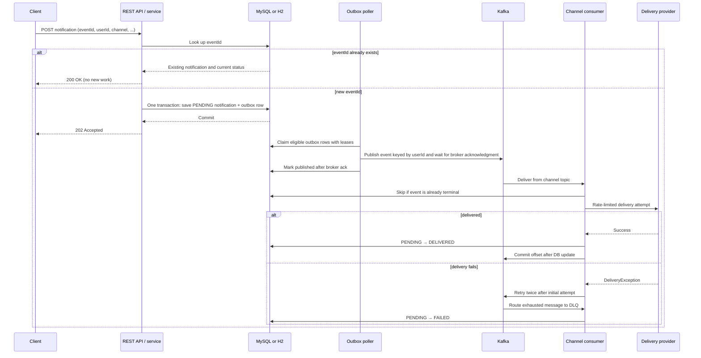

# Distributed Notification Service

A Spring Boot service that accepts email, SMS, and push notifications, persists each request, and delivers it asynchronously through Apache Kafka. It uses a transactional outbox, idempotent submission, per-channel consumers, retry/DLQ handling, rate limiting, and Micrometer metrics. The included delivery provider simulates delivery; `NotificationDeliveryProvider` is the extension point for a real email, SMS, or push provider.

## Request and delivery flow



1. `POST /api/v1/notifications` validates the request. `eventId` is the idempotency key. A fast database lookup handles ordinary duplicates; a unique database constraint handles simultaneous first submissions. If two requests race, the losing transaction rolls back and the service returns the persisted winner's state.
2. For a new event, `NotificationSubmissionWriter` writes the notification (`PENDING`) and serialized outbox event in the same database transaction. This avoids losing work between a database commit and a Kafka publish.
3. `OutboxPoller` runs every two seconds by default and claims up to 100 eligible rows. A database lease and claim token let multiple application instances work without intentionally claiming the same row. Claim selection allows only the oldest unpublished event for a given topic and user key. The poller renews the lease, waits for Kafka's broker acknowledgement, and then marks the row published. A failed send releases the lease; a crashed worker's lease expires after five minutes so another poll can recover it.
4. Events go to `notification.email`, `notification.sms`, or `notification.push`. Each topic has its own consumer group. The Kafka key is `userId`; three partitions per topic allow up to three active consumers per channel group while preserving order for one user within that topic. Ordering across different channel topics is not guaranteed.
5. A channel consumer applies its configured rate limit and calls `NotificationDeliveryProvider`. On success, it changes the database state from `PENDING` to `DELIVERED`, then manually acknowledges the Kafka offset. On a `DeliveryException`, Spring Kafka performs one initial attempt plus two retries (two-second fixed backoff by default); exhausted messages are published to `notification.dlq`, where `DlqConsumer` marks them `FAILED` and acknowledges them.
6. `GET /api/v1/notifications/{eventId}` returns the current state. Consumers skip provider calls for already-terminal events (`DELIVERED` or `FAILED`), which makes Kafka replay safer.

### Delivery guarantees and boundaries

- The outbox and Kafka bridge provide **at-least-once** publishing. If the process stops after Kafka accepts an event but before the outbox row is marked published, it may publish again after recovery.
- The database's conditional state updates and terminal-state check prevent ordinary replays from triggering another provider call after a completed state is visible. They cannot make an external provider side effect atomic with the database. A production provider adapter should pass `eventId` as its provider-side idempotency key where supported.
- The retry handler uses in-memory retries, so the retry schedule itself does not survive a process restart. Use durable retry topics if restart-resilient retry scheduling is required.
- Rate limiting is in-process. With multiple application replicas, each replica has its own limiter; a cluster-wide provider quota needs a shared/distributed limiter.

## Components and design responsibilities

| Area | Main types | Responsibility |
|---|---|---|
| HTTP boundary | `NotificationController`, request/response DTOs | Validation, HTTP status codes, request and status endpoints |
| Application services | `NotificationService`, `NotificationSubmissionWriter` | Idempotency/status operations and atomic notification/outbox persistence |
| Persistence | `Notification`, `OutboxEvent`, repositories | Notification state, outbox records, uniqueness and claim operations |
| Outbox publisher | `OutboxClaimService`, `OutboxPoller` | Lease claims, Kafka publishing, recovery and publish metrics |
| Kafka boundary | `KafkaConfig`, `NotificationEvent`, consumers | Topics, serialization, consumer groups, manual commits, retries and DLQ routing |
| Delivery boundary | `NotificationDeliveryProvider`, `MockDeliveryService` | Provider abstraction and local simulated delivery |
| Cross-cutting concerns | `ChannelRateLimiterService`, `NotificationMetrics` | Per-channel throttling and Micrometer metrics |
| Schema | `db/migration` | Versioned Flyway database migrations; Hibernate validates the schema |

The channel consumers share a provider interface and the same delivery/state-transition approach. Keep channel-specific API credentials and provider SDK details inside provider adapters rather than controllers or Kafka consumers.

## Technology

| Component | Technology |
|---|---|
| Language / framework | Java 17, Spring Boot 3.5.16 |
| API documentation | Springdoc OpenAPI / Swagger UI |
| Messaging | Spring Kafka, Apache Kafka; embedded Kafka for the `local` profile |
| Persistence | Spring Data JPA, Flyway, H2 locally; MySQL supported |
| Metrics | Spring Boot Actuator, Micrometer |
| Rate limiting | Guava `RateLimiter`, configured per channel |
| Build | Maven |
| Optional local database | Docker Compose and MySQL 8.4 |

## Run locally

### Prerequisites

- Java 17 (a JDK, not only a JRE)
- Maven 3.9 or later
- Docker Desktop only if you want to use the optional MySQL container; the default local profile needs no Docker or separately installed Kafka

The repository root is the workspace/aggregator. The Spring Boot application, this README, its `pom.xml`, and `docker-compose.yml` are in the nested `notification-service-v2` module. Run the application commands below from that module directory:

```bash
mvn spring-boot:run
```

The default `local` profile uses an in-memory H2 database and starts a one-broker embedded Kafka instance on port `19092`; the service creates its four topics on startup. Docker is not required for this mode. The mock provider has a configurable 30% simulated failure rate, so some notifications will exercise retry and DLQ handling.

To use the optional MySQL container while retaining local embedded Kafka:

```powershell
docker compose up -d mysql
$env:SPRING_DATASOURCE_URL = "jdbc:mysql://localhost:3306/notificationdb"
$env:SPRING_DATASOURCE_USERNAME = "notification"
$env:SPRING_DATASOURCE_PASSWORD = "notification"
mvn spring-boot:run
```

The MySQL credentials above are development-only values from `docker-compose.yml`. Flyway applies the versioned migrations; Hibernate is configured to validate, not create, the schema.

## Run with external production infrastructure

The `prod` profile expects externally managed MySQL and Kafka. It disables the H2 console and Swagger endpoints, exposes a limited set of Actuator endpoints, and defaults Kafka topic replication to three. Configure a Kafka cluster with enough brokers for that replication factor.

```powershell
$env:SPRING_PROFILES_ACTIVE = "prod"
$env:SPRING_DATASOURCE_URL = "jdbc:mysql://localhost:3306/notificationdb"
$env:SPRING_DATASOURCE_USERNAME = "notification_user"
$env:SPRING_DATASOURCE_PASSWORD = "<your-secret>"
$env:SPRING_KAFKA_BOOTSTRAP_SERVERS = "kafka-1:9092,kafka-2:9092"
mvn spring-boot:run
```

Supply secrets through your deployment's secret manager; do not commit real credentials. Production infrastructure, topic provisioning, TLS/SASL, and provider credentials are deployment responsibilities.

## API

### Submit a notification

```bash
curl -X POST http://localhost:8080/api/v1/notifications \
  -H "Content-Type: application/json" \
  -d '{
    "eventId": "550e8400-e29b-41d4-a716-446655440000",
    "userId": "user-123",
    "channel": "EMAIL",
    "recipient": "user@example.com",
    "message": "Your order has been confirmed"
  }'
```

New event: **202 Accepted**, with `status: PENDING`. Reusing the same `eventId`: **200 OK**, returning the existing notification fields and its current status (`PENDING`, `DELIVERED`, or `FAILED`). Reuse an event ID only when the request represents the same logical notification.

`channel` accepts `EMAIL`, `SMS`, or `PUSH`. Request validation errors return **400 Bad Request** with field-level details.

### SMS and PUSH examples

Use a new `eventId` for each logical notification. SMS and PUSH use the same endpoint and payload shape; only the channel and recipient format change.

```bash
# SMS
curl -X POST http://localhost:8080/api/v1/notifications \
  -H "Content-Type: application/json" \
  -d '{"eventId":"660e8400-e29b-41d4-a716-446655440001","userId":"user-123","channel":"SMS","recipient":"+14155552671","message":"Your verification code is 847291"}'

# PUSH (recipient is a device token in this example)
curl -X POST http://localhost:8080/api/v1/notifications \
  -H "Content-Type: application/json" \
  -d '{"eventId":"770e8400-e29b-41d4-a716-446655440002","userId":"user-456","channel":"PUSH","recipient":"device-token-example","message":"You have a new message"}'
```

### Check status

```bash
curl http://localhost:8080/api/v1/notifications/550e8400-e29b-41d4-a716-446655440000
```

Returns **200 OK** and the current notification response, or **404 Not Found** if no event exists.

### Swagger and operational endpoints

- Swagger UI: [http://localhost:8080/swagger-ui.html](http://localhost:8080/swagger-ui.html)
- OpenAPI JSON: [http://localhost:8080/api-docs](http://localhost:8080/api-docs)
- Application health: `GET /api/v1/notifications/health`
- Actuator health: `GET /actuator/health`
- In local mode, the H2 console is available at `http://localhost:8080/h2-console`.

Micrometer metrics include submission, duplicate, delivered, failed-attempt and DLQ counters tagged by channel, delivery-duration timers, rate-limit wait counters, outbox publish counters, and pending-count gauges. Inspect registered metrics at `GET /actuator/metrics`. The `prod` profile exposes the Prometheus Actuator path, but this project does not currently include the Prometheus registry dependency; add `micrometer-registry-prometheus` before expecting `/actuator/prometheus` to serve scrape data.

Swagger and H2 console are disabled in the `prod` profile. The local profile exposes all Actuator endpoints for development; review and restrict exposure before deploying it outside a trusted local environment.

## Configuration reference

| Property / environment variable | Default | Purpose |
|---|---:|---|
| `SPRING_PROFILES_ACTIVE` | `local` (default profile) | Selects local or production configuration |
| `SPRING_DATASOURCE_URL` | In-memory H2 URL | JDBC connection URL |
| `SPRING_DATASOURCE_USERNAME` / `SPRING_DATASOURCE_PASSWORD` | `sa` / blank | Database credentials |
| `SPRING_KAFKA_BOOTSTRAP_SERVERS` | `localhost:19092` | Kafka broker addresses |
| `KAFKA_TOPIC_REPLICATION_FACTOR` | `3` in `prod`; `1` otherwise | Replication factor for application-created topics |
| `outbox.poll.interval-ms` | `2000` | Fixed delay between completed outbox polls |
| `outbox.poll.batch-size` | `100` | Maximum rows claimed per poll |
| `outbox.claim.lease-ms` | `300000` | Outbox claim lease duration |
| `kafka.consumer.retry.max-attempts` | `2` | Retries after the initial delivery attempt |
| `kafka.consumer.retry.backoff-ms` | `2000` | Fixed delay between delivery attempts |
| `mock.delivery.failure-rate` | `0.30` | Simulated provider failure probability |
| `rate-limit.email` / `sms` / `push` | `10` / `50` / `100` | Permits per second per channel and app instance |

## Database migrations

- `V1__create_notification_tables.sql` creates the notification and outbox tables and their initial constraints/indexes.
- `V2__add_outbox_claim_leases.sql` adds outbox lease and claim-token fields used to coordinate pollers.

Flyway runs at application startup. Hibernate uses `ddl-auto: validate`, so schema changes should be added as migrations rather than relying on automatic DDL generation.

## Tests

From the workspace root, run:

```bash
mvn test
```

The test profile uses an isolated database/configuration and disables listener auto-start. The current six tests cover the JPA test-slice context, sequential and concurrent idempotent submissions, outbox claim/order behavior, conditional terminal-state transitions, and email-consumer replay suppression. They are focused behavior tests, not a full end-to-end test against external MySQL/Kafka or real delivery providers.

## Project status and limitations

This is a portfolio/local-development implementation of the notification flow. Before using it for real customer notifications, account for these current boundaries:

- Delivery is simulated by `MockDeliveryService`; no real email, SMS, or push provider adapter is included.
- The REST API has no authentication or authorization configured. Do not expose it publicly as-is.
- Retries use Spring Kafka's in-memory error handler, and channel rate limiters are local to each application instance. Durable retry queues and shared quota enforcement need additional infrastructure.
- Kafka is embedded for local runs. The `prod` profile expects an external Kafka cluster and MySQL, but does not configure cluster security, topic retention/monitoring, deployment orchestration, or alerting.
- The production profile exposes the Prometheus Actuator path, but the Prometheus registry dependency is not currently included. Add `micrometer-registry-prometheus` to enable Prometheus scrape output.
- The repository includes an unused `NotificationProducer` helper; actual event publication follows the transactional outbox path through `OutboxPoller`.

These are extension points and deployment requirements, not guarantees provided by the current local demo.

## Repository layout

```text
src/main/java/com/notificationservice/
├── config/       Kafka and local embedded Kafka configuration
├── consumer/     Email, SMS, and push Kafka listeners
├── controller/   REST API boundary
├── dlq/          Dead-letter consumer
├── dto/          Validated request and response models
├── entity/       Notification and Kafka event models
├── exception/    Delivery failure type
├── metrics/      Notification counters and timers
├── outbox/       Outbox entity, repository, lease service, poller
├── producer/     NotificationProducer helper (currently unused; outbox poller is the active publisher)
├── repository/   Notification persistence queries
└── service/      Submission, delivery, and channel rate-limit services

src/main/resources/db/migration/   Flyway SQL migrations
src/test/                          Application and behavior tests
docker-compose.yml                 Optional local MySQL service
```

## DLQ troubleshooting

With the default mock failure rate, failed attempts are expected during local runs. Search the application logs for retry messages and `Moving event to DLQ`. Once the DLQ consumer handles the event, status becomes `FAILED`; confirm it through the status endpoint. The failure state records retry count `3` (initial attempt plus two retries).

## Stop local services

Stop the application with `Ctrl+C`. If you started the optional MySQL container and want to remove its local data volume as well:

```bash
docker compose down -v
```
